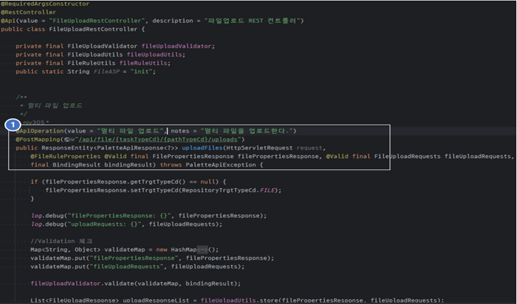

# Palette3.0 개발표준가이드(API)
> **Version 1.0**

본 개발 표준은 Palette3.0 개발부문에 적용할 표준을 정의하는 것으로
개발자 상호간에 개발 표준을 공유하여 소스 코드의 일관성 확보를 목적으로
한다.

# 공통 사항

## Coding 원칙

- 주석은 모든 코드에 상세히 기술하는 것을 원칙으로 한다.

- 소스 코드는 불가피한 내용을 제외하고 원칙적으로 중복을 금지한다.

- 소스 코드에서 사용하는 모든 단어는 용어사전(.nsm) 의 내용을 기준으로
  한다.

- 개발 및 테스트를 수행함에 있어 기능과 성능은 물론 보안에도 각별한
  주의를 기울인다

## Coding Style

코딩 스타일은 소스개발에 대한 규칙을 정의하는 것으로 표준화와 일관성을
확보하는 것을 목적으로 한다.

> ※ 아래 형식이 적용된 기 배포된 표준화된 포매터(Code
Formatter)를 각 개발 도구에 맞는 스타일을 임포트하여
활용한다. 
> 
> &lt;WORKSPACE&gt;/palette3-setting/eclipse-java-google-style.xml
이클립스(Ctrl+Shift+F)  
> &lt;WORKSPACE&gt;/palette3-setting/intellij-java-google-style.xml
인텔리제이(Ctrl+Alt+L)

## 모든 파일 인코딩은 UTF-8을 사용한다.

## 들여쓰기(indent)

- tab 문자 대신 space 문자 4개 사용
> tab 문자는 에디터 프로그램이나 사용자 설정에 따라 간격이 다르게
보여질 수 있기 때문에 tab 문자 대신 space 문자를 사용한다.

## 띄어쓰기(space)

- 메소드 이름 다음에는 띄어쓰기 없이 왼쪽 괄호를 사용한다.

>foo (i, j); // NO!

>foo(i, j); // YES!

- 배열 다음에는 띄어쓰기 없이 왼쪽 괄호를 사용한다.

>args [0]; // NO!

>args[0]; // YES!

- 이진 연산자 간에는 양쪽에 띄어쓰기를 사용한다.

>a=b+c; // NO!

>a = b+c; // NO!

>a=b + c; // NO!

>a = b + c; // YES!

>z = 2*x + 3*y; // NO!

>z = 2 * x + 3 * y; // YES!

>z = (2 * x) + (3 * y); // YES!

- 쉼표와 세미콜론 뒤에는 띄어쓰기를 사용한다.
>for (int i = 0;i &lt; 10;i++) // NO!

>for (int i = 0; i &lt; 10; i++) // YES!

>selectScheduleRtn(syrupQuantity,butterQuantity); // NO!

>selectScheduleRtn(syrupQuantity, butterQuantity); // YES!

- cast 사용시 띄어쓰기 없이 작성한다.
>(MyClass) v.get(3); // NO!

>( MyClass )v.get(3); // NO!

>(MyClass)v.get(3); // YES!

- if, while, for, switch, catch 문 뒤에는 띄어쓰기를 사용한다.
>if(jsonParams) // NO!

>if (jsonParams) // YES!

>while(pancakes &lt; 7) // NO!

>while (pancakes &lt; 7) // YES!

>for(int i = 0; i &lt; 10; i++) // NO!

>for (int i = 0; i &lt; 10; i++) // YES!

>catch(TooManyPancakesException e) // NO!

>catch (TooManyPancakesException e) // YES!

- 단항연산공백(unary operation space)은 붙여서 사용한다. (ex. i++;)

## 중괄호(brace)

- K&R 스타일 사용. 시작하는 중괄호는 새로운 라인에서 시작하지 않고
  제어문과 같은 라인을 사용한다.
>if (palette == theTick) 
>{ 
>&nbsp;&nbsp;&nbsp;&nbsp;System.out.println("Phone!"); 
>} // NO! ==&gt; BSD Style

>if (palette == theTick) { 
>&nbsp;&nbsp;&nbsp;&nbsp;System.out.println("Phone!"); 
>} // YES!

- 제어문이 한 줄이더라도 중괄호를 생략하지 않는다.
>if (superHero == theTick) System.out.println("Spoon!"); //
NO!

>if (superHero == theTick) 
>&nbsp;&nbsp;&nbsp;&nbsp;System.out.println("Spoon!"); // NO!

>if (superHero == theTick) { 
>&nbsp;&nbsp;&nbsp;&nbsp;System.out.println("Spoon!"); 
>} // YES!

- 중괄호 안의 중괄호는 indent(4-space)를 준다.

- 중괄호에 주석을 기입하는 경우 ‘//’ 주석을 사용한다.

## 클래스 맴버 정렬 순서

- 클래스 멤버는 필드(전역변수), 생성자, 메소드 순서로 정렬한다.
>class Palette3{ 
>&nbsp;&nbsp;&nbsp;&nbsp;// fields (attributes) 
>&nbsp;&nbsp;&nbsp;&nbsp;// constructors 
>&nbsp;&nbsp;&nbsp;&nbsp;// methods 
>}

## 라인 최대 길이(Hard wrap at)

- 120 칸을 넘지 않는다. (최대 140)

## C 스타일 배열 선언 사용 금지
>String args[] // bad

>String[] args // good 
## 지시자의 표기는 자바언어 사양상의 등장 순서를 지킨다.
>public protected private abstract static final transient volatile
synchronized native strictfp

## do..while 사용하지 않는다.

do..while 문은 조건이 코드 아래 부분에 있기 때문에 가독성이 좋지 않고,
경험이 적은 프로그래머에게도 익숙하지 않은 문법이다.
>So rather than: 
>boolean done = false; 
>do 
>{ 
>&nbsp;&nbsp;&nbsp;&nbsp;... 
>} while (!done)

>use: 
>boolean done = false; 
>while (!done) 
>{ 
>&nbsp;&nbsp;&nbsp;&nbsp;... 
>} 

##  메소드 중간에 return을 사용하지 않는다.

return은 메소드 마지막에 사용한다.

return이 중간에 있다면 메소드를 수정할 경우 고려할 사항이 많아지고
버그를 유발시킬 가능성이 높아진다.

##  와일드 카드 임포트 사용 금지.
>import java.io.*; // bad 
>import java.io.File; // good 
>import java.io.FileReader; // good 

# 네이밍

## 공통

java class file 은 필요 시 전자정부 사업을 위한 wrapper를 생성하여
사용함으로써 객체에 대한 추상화와 구현 시의 유연성을 확보한다. java
class작성 시에 해당 package, file 및 method의 명명 규칙과 coding style을
준수하여 일관성 있는 개발이 되도록 한다.

## 명명규칙

## 패키지명

- 소문자만 사용한다. 되도록 8자 이내.
- 복합단어를 사용하지 않는다.
>Examples:

>&nbsp;&nbsp;&nbsp;&nbsp;excelApi // NO!

>&nbsp;&nbsp;&nbsp;&nbsp;excel.api // YES

- 기본 패키지 명명규칙은 다음과 같다.

<table style="width: 100%">
<colgroup>
<col style="width: 10%" />
<col style="width: 18%" />
<col style="width: 70%" />
</colgroup>
<thead>
<tr class="header">
<th colspan="2"><strong>package 명</strong></th>
<th><strong>설 명</strong></th>
</tr>
</thead>
<tbody>
<tr class="odd">
<td colspan="2">kr.co.hkcloud.palette3</td>
<td>Palette 3.0 컴포넌트 및 개발프레임워크 총괄 도메인명</td>
</tr>
<tr class="even">
<td colspan="2">시스템명(모듈별)</td>
<td>
common (공통모듈)

admin (관리모듈-기업고객관리(테넌트) 등)

login (인증모듈)

phone (전화상담모듈)

chat (채팅상담모듈)

km (지식관리모듈)

svy (설문모듈)

…
</td>
</tr>
<tr class="odd">
<td colspan="2">세부업무명</td>
<td>세부업무(board, dashboard, history …등)</td>
</tr>
<tr class="even">
<td rowspan="5">용도별</td>
<td>web</td>
<td>
controller 클래스를 가지고 있는 패키지

kr.co.hkcloud.palette3.&lt;모듈명&gt;.&lt;업무명&gt;.web

예. kr.co.hkcloud.palette3.chat.dashboard.web
</td>
</tr>
<tr class="odd">
<td>service</td>
<td>
서비스인터페이스, 서비스 구현 클래스를 가지고 있는 패키지

예. kr.co.hkcloud.palette3.chat.dashboard.service
</td>
</tr>
<tr class="even">
<td>dao</td>
<td>dao 클래스를 가지는 패키지.(필요시)</td>
</tr>
<tr class="odd">
<td>dao.xml</td>
<td>쿼리 xml 위치.</td>
</tr>
<tr class="even">
<td>util</td>
<td>업무별 Validator 및 유틸성 클래스 위치</td>
</tr>
</tbody>
</table>

## 클래스와 인터페이스명

- 각 단어의 첫 글자는 대문자로 나머지는 소문자를 사용한다.
  \[세부업무\]\[postfix\].java 로 한다.

- postfix는 framework에서 정의하는 class요소에 대한 구분으로 해당 java
  class의 성격을 나타낸다. (ex. postfix : Controller, Wrapper, Service,
  ServiceImpl, Cmd, DAO, VO, Test 등)

- 기본 클래스 명명규칙은 다음과 같다.

<table>
<colgroup>
<col style="width: 11%" />
<col style="width: 18%" />
<col style="width: 69%" />
</colgroup>
<thead>
<tr class="header">
<th colspan="2"><strong>구분</strong></th>
<th><strong>설 명</strong></th>
</tr>
</thead>
<tbody>
<tr class="odd">
<td rowspan="3">클래스명</td>
<td>Controller</td>
<td>
&lt;대상업무명&gt;+Controller

예. BoardController, ChatDashboardCounselController
</td>
</tr>
<tr class="even">
<td>
Service

ServiceImpl
</td>
<td>
서비스인터페이스, 서비스 구현 클래스를 가지고 있는 패키지

예.

kr.co.hkcloud.palette3.chat.dashboard.service.BoardService

kr.co.hkcloud.palette3.chat.dashboard.service.BoardServiceImpl
</td>
</tr>
<tr class="odd">
<td>Mapper</td>
<td>
&lt;대상업무명&gt;+Mapper_&lt;DB&gt;.xml

예. PhoneCallbackListMapper_Postgresql.xml
</td>
</tr>
</tbody>
</table>

## URI (REST API)명

<table>
<colgroup>
<col style="width: 22%" />
<col style="width: 18%" />
<col style="width: 58%" />
</colgroup>
<thead>
<tr class="header">
<th colspan="2"><strong>구분</strong></th>
<th><strong>URI</strong></th>
</tr>
</thead>
<tbody>
<tr class="odd">
<td rowspan="7">@RequestMapping</td>
<td>common (공통모듈)</td>
<td>
/api/&lt;단위업무패키지&gt;/select**** (단건조회)

/api/&lt;단위업무패키지&gt;/select****List (다건조회)

/api/&lt;단위업무패키지&gt;/insert**** (등록)

/api/&lt;단위업무패키지&gt;/update**** (수정)

/api/&lt;단위업무패키지&gt;/delete**** (삭제)

/api/&lt;단위업무패키지&gt;/merge**** (등록+수정)

/api/&lt;단위업무패키지&gt;/validate**** (검증)

/api/&lt;단위업무패키지&gt;/check**** (조건확인)

/api/&lt;단위업무패키지&gt;/is**** (유무확인)
</td>
</tr>
<tr class="even">
<td>admin (관리모듈)</td>
<td>/admin-api/&lt;단위업무패키지&gt;/…(상동)</td>
</tr>
<tr class="odd">
<td>login (인증모듈)</td>
<td>/auth-api/&lt;단위업무패키지&gt;/…(상동)</td>
</tr>
<tr class="even">
<td>phone (전화상담모듈)</td>
<td>/phone-api/&lt;단위업무패키지&gt;/…(상동)</td>
</tr>
<tr class="odd">
<td>chat (채팅상담모듈)</td>
<td>/chat-api/&lt;단위업무패키지&gt;/…(상동)</td>
</tr>
<tr class="even">
<td>km (지식관리모듈)</td>
<td>/km-api/&lt;단위업무패키지&gt;/…(상동)</td>
</tr>
<tr class="odd">
<td>svy (설문모듈)</td>
<td>/svy-api/&lt;단위업무패키지&gt;/…(상동)</td>
</tr>
</tbody>
</table>

## 메소드명

변수명은 대소문자를 혼합하여 작성합니다. 첫 글자가 소문자여야 하며 각
내부 단어의 첫 글자는 대문자여야 합니다. (소문자로 시작하는 카멜케이스)
밑줄(\_)과 달러기호($)로 시작하는 변수명은 사용이 금지한다.

- 기본 메소드 명명규칙은 다음과 같다.

<table>
<colgroup>
<col style="width: 11%" />
<col style="width: 27%" />
<col style="width: 39%" />
<col style="width: 21%" />
</colgroup>
<thead>
<tr class="header">
<th colspan="2"><strong>구분</strong></th>
<th></th>
<th><strong>설 명</strong></th>
</tr>
</thead>
<tbody>
<tr class="odd">
<td rowspan="3">메소드명</td>
<td>business 처리관련</td>
<td>
내용검증: validate

조건확인: check

유무확인: is+(명사,진행형,형용사.)

검색: search

연계: contact

action: action

파일관리 읽기: - read

파일관리 쓰기: - write

파일관리 다운로드: - download
</td>
<td></td>
</tr>
<tr class="even">
<td>Controller/Service</td>
<td>
단건조회: select

목록조회: select***List

등록: insert****

단건수정: update****

삭제: delete***

등록+수정+삭제: merge****
</td>
<td>
selectCategory() selectCategoryList()

insertCategory()

updateCategory()

deleteCategory()

mergeCategory()
</td>
</tr>
<tr class="odd">
<td>Repository/Mapper/xml</td>
<td>
조회: select

등록: insert

수정: update

삭제: delete

등록/수정: merge
</td>
<td>
selectCategory

insertCategory

updateCategory

deleteCategory

mergeCategory
</td>
</tr>
</tbody>
</table>

## 변수 와 상수

- Java 변수의 명명규칙은 \[용어사전\]을 조합하여 30자 이내로 명명 한다.

- 첫 글자는 소문자를 사용하며 이후 용어의 첫 글자만 대문자를 사용하며,
  숫자 및 특수문자는 사용하지 않는다.

- loop index에서 사용하는 변수는 i,j,k,l,x,y,z 등을 (관용적으로) 사용할
  수 있다.

> (단, 데이터베이스의 속성명을 그대로 사용하는 경우에는 ‘\_’ 사용을 허용)

- 상수는 Static Final 변수는 용어사전을 사용하여 대문자로만 작성하며
  단어 사이는 '\_'를 사용하여 구분한다. 모든 static final 필드가 상수는
  아님 (SUCEESS=1, FAIL=0 으로 정의한다.)

# 주석

## 주석

###  자바 클래스 주석

- 주석은 아래의 표준을 준수하여 작성하여 자바문서화 주석 으로 생성 및
  (Javadoc) 사용한다.

- 클래스(인터페이스)명 클래스설명 수정이력(수정이 발생할 경우에만 해당),
  작성자, 최초작성일, 버전, 참조클래스, 권리(Copyright) 를 명시한다.

- Template
<blockquote>
/** 
&nbsp;* &lt;&lt; 여기에 설명. &gt;&gt; 
&nbsp;* 
&nbsp;* @author KJD 
&nbsp;* @since 2023-11-22 
&nbsp;* @version 1.0 
&nbsp;* &lt;pre&gt; 
&nbsp;* =================================== 
&nbsp;* DATE AUTHOR NOTE 
&nbsp;* ----------------------------------------------------------- 
&nbsp;* 2023-11-22 KJD 최초 생성 
&nbsp;* &lt;/pre&gt; 
*/ 
</blockquote>

###  변수 주석.

- Class 변수 주석 Template
<blockquote>
/** 이름 */ 
private String name;

/** 객체 값 */ 
private Object val = null;
</blockquote>

- method 내의 변수 주석 template
<blockquote>
<td>
int ilevel; // indentation level

int iSize; // size of table

Object currentEntry; // currently selected table entry

</blockquote>

# 업무서비스 개발

## 개발환경

### 프로젝트 구조

<table>
<colgroup>
<col style="width: 10%" />
<col style="width: 23%" />
<col style="width: 13%" />
<col style="width: 7%" />
<col style="width: 10%" />
<col style="width: 33%" />
</colgroup>
<thead>
<tr class="header">
<th colspan="5"><strong>계층 구조(IDE의 Package Explorer
기준)</strong></th>
<th><strong>설 명</strong></th>
</tr>
</thead>
<tbody>
<tr class="odd">
<td rowspan="3">palette3-hkcloud-edu-webm</td>
<td rowspan="3">
common (공통모듈)

admin (관리모듈)

login (인증모듈)

phone (전화상담모듈)

chat (채팅상담모듈)

km (지식관리모듈)

svy (설문모듈)
</td>
<td>src</td>
<td>main</td>
<td>java</td>
<td>개발자가 작성한 JAVA 클래스파일이 위치하는 곳으로 각 단위업무별로
Controller, Service, ServiceImpl, xml 총 4종류의 파일이 한 쌍을 이루는
구조를 가진다.</td>
</tr>
<tr class="even">
<td></td>
<td></td>
<td>resources</td>
<td>스프링프레임워크 기반의 관련 설정파일을 위치한다.</td>
</tr>
<tr class="odd">
<td>build.gradle</td>
<td></td>
<td></td>
<td>공통모듈관련 Gradle파일.</td>
</tr>
<tr class="even">
<td></td>
<td>doc</td>
<td></td>
<td></td>
<td></td>
<td>erd, 설정 매뉴얼 등등 공유하고자하는 파일 위치</td>
</tr>
<tr class="odd">
<td></td>
<td>gradle</td>
<td></td>
<td></td>
<td></td>
<td>gradle빌드관련</td>
</tr>
<tr class="even">
<td></td>
<td>libs</td>
<td></td>
<td></td>
<td></td>
<td>각 모듈에서 필요한 custom lib관리</td>
</tr>
<tr class="odd">
<td></td>
<td>palette3-setting</td>
<td></td>
<td></td>
<td></td>
<td>공유하고자하는 IDE코드템플릿, 고딩스타일 설정파일.</td>
</tr>
<tr class="even">
<td></td>
<td>scouter</td>
<td colspan="2"></td>
<td></td>
<td>apm 관련파일</td>
</tr>
<tr class="odd">
<td></td>
<td>build.gradle</td>
<td colspan="2"></td>
<td></td>
<td>프로젝트 전체 빌드관련 설정 파일.</td>
</tr>
<tr class="even">
<td></td>
<td>cloud_start.sh</td>
<td colspan="2"></td>
<td></td>
<td>scouter + dockerfile 실행용도.</td>
</tr>
<tr class="odd">
<td></td>
<td>Dockerfile</td>
<td colspan="2"></td>
<td></td>
<td>docker이미지를 만들기위한 설정</td>
</tr>
<tr class="even">
<td></td>
<td>settings.gradle</td>
<td colspan="2"></td>
<td></td>
<td>앱을 빌드할 때 포함해야 하는 모듈</td>
</tr>
<tr class="odd">
<td></td>
<td></td>
<td colspan="3"></td>
<td></td>
</tr>
</tbody>
</table>

## 업무 로직

### 서비스 기본 흐름

UI에서 요청된 API request는 프레임워크 구조를 따라 Controller –
Implement – Dao 를 거쳐서 다시 클라이언트로 반환되며 그 과정에서 몇몇
공통모듈이 동작하며 서비스 처리를 돕는다. 보통 하나의 업무패키지는 3개의
클래스 파일과 VO클래스(필요시), 그리고 1개의 SqlMap 파일로 이루어지며
IDE상에서 파일의 위치와 구조는 아래 샘플 화면과 같다.

- 업무명+Controller.java : Controller 클래스
- 업무명+Service.java : Service 클래스
- 업무명+ServiceImpl.java : Implement 클래스
- 테이블명/기능명+VO.java : VO(Value Object) 클래스 (필요시)
- 업무명Mapper\_\<DB밴더\>.xml : SQL Map

### Controller

Controller 클래스는 Presentation View(UI)에서의 요청을 1차적으로
처리하는 객체로써 Controller 클래스내의 한 메소드는 보통 C/R/U/D 중
하나의 서비스를 담당한다. 각 메소드는 Request 파라미터의
@TelewebJsonParam TelewebJSON 변환, 서비스함수(\*Impl 클래스의 메소드)
호출, 결과 메시지 설정 등의 동작을 수행한다.

URI (REST API)명 을 참조하여 RequestMapping URI를 작성한다.

- 1\. 컨트롤러 선언

> 클래스 명칭은 반드시 “Controller”로 끝나야 한다. 또한 @Controller 또는
> @RestController어노테이션을 사용하여 해당 클래스가 WAS 기동시 컴포넌트
> 스캔이 되도록 한다.

- 2\. 서비스구현 객체 생성

> 컨트롤러 클래스에서 사용할 서비스구현 객체를 생성한다. 이 때에도
> @Resource 어노테이션을 통해 bean 이름을 넘겨주어서 자동으로
> 객체바인딩이 되도록 한다. 참고로, 예제에서는 “업무명Service”라는
> 명칭이 두 번 반복되는데 변수명은 Camel Casing으로 작성한다.

- 3\. RequestMapping

> 특정 서비스 요청시 세팅한 action 값으로부터 원하는 특정 메소드를
> 다이렉트로 매핑시킬 수가 있다. 이곳에서 사용하는 매핑값은 프로젝트내의
> 모든 컨트롤러 파일내에서 유일해야 한다.
>
> Palette3.0에서는 컨트롤러에서 SqlMap까지의 서비스 계층간 데이터 전달에
> TelewebJSON 객체를 사용한다. 사전에 정의해 놓은 클래스를 위 예제와
> 같이 @TelewebJsonParam 어노테이션을 사용하여 파라미터로 선언하면
> Request Parameter들이 멤버변수로 자동 바인딩된다.

- 4\. 서비스구현 메소드 호출

> 사용자가 요청한 업무에 대한 실질적인 처리 로직이 담겨있는 서비스구현
> 객체의 메소드를 호출한다.

- 5\. 결과값 반환

> 결과 데이터는 TelewebJSON 객체에 담겨져 반환되며 클라이언트로
> 전달된다.

### Service

Service 인터페이스는 서비스요청을 처리할 업무로직에 대한 명세를 작성하는
곳으로 이곳에서는 메소드에 대한 선언부만 존재하고 실제 구현부는
ServiceImplement 클래스에서 작성된다.

- 1\. interface

> Service는 Class가 아닌 interface로 선언해야 함을 주의해야 한다.

- 2\. 메소드 명세

> Service 인터페이스내의 모든 메소드는 선언부만 존재 한다.

### ServiceImplement

Implement 클래스는 service 인터페이스에서 선언된 명세에 따라 실제
비즈니스 로직을 구현하는 곳으로 Controller로부터 받은 VO 객체로 Mapper
SQL을 호출하고 결과데이터를 정제하는 등의 작업을 수행한다. 비즈니스
로직을 서비스구현 클래스가 아닌 컨트롤러 클래스에서 처리되도록 코드를
작성하는 개발자가 종종 있는데 에러는 발생하지 않지만 이것은 프레임워크
기본사상에 위배되는 행위이므로 가급적 비즈니스 로직은 서비스
구현클래스에 기술하도록 한다.

- 1\. Service Annotaion 선언 및 상속클래스, 인터페이스 사용

> 컨트롤러 클래스에서 해당 서비스구현 클래스를 참조할 때 필요한
> bean명칭을 정해야 한다. 이 때의 명명규칙은 첫 단어는 소문자로 시작하고
> 다음 단어부터는 대문자로 시작하는 Camel 표기법을 따른다. 또한,
> 인터페이스를 구현해야 한다.

- 2\. 사용할 DAO 인스턴스 생성 및 로직에 필요한 서비스 인스턴스를
  생성한다.

> 서비스구현 클래스는 TwbComDAO(공통DAO)객체를 통해 SQL쿼리를 수행할 수
> 있으며, @Resource 어노테이션을 통하면 단순 선언을 통해서도 자동으로
> 인스턴스를 생성할 수 있다.

- 3\. 로직 처리.

> 컨트롤러클래스로부터 넘겨받은 객체에 대한 데이터 검증 및 필요한 로직을
> 수행하고 DAO의 메소드를 통해 SELECT/INSERT/UPDATE/DELETE등을 수행한다.
>
> 대부분의 리턴타입은 TelewebJSON형태이며, 필요시 결과값을 반환하기 전에
> 후처리 과정을 통해서 데이터 정제를 수행한 후에 리턴한다.

### SQL Mapper

SqlMap 파일은 업무에서 사용되는 SQL에 대해 정의해 놓은 파일이다. DAO
객체에서는 이 SqlMap에 있는 SQL을 호출하며 이 과정에서 sql id를 통해
식별한다.

- 1\. SQL Mapper 작성시 네임스페이스는 Dao interface로 설정합니다.
  Impl에서 호출시 확인 필요함.

- 2\. Mapper에서 parameterType 과 resultType은 java.util.Map 사용을
  사용한다. 추후 Map은 지양하고, Value Object를 기반으로 설계가 필요해
  보인다.

- 3\. 쿼리 내용

> 실제 수행할 SQL 본문을 작성하는 곳으로 특별한 규약은 없지만 적절한
> 띄어쓰기를 사용하여 가독성이 높은 SQL 구문을 작성하는 것이
> 기본원칙이다. 또한 특수 문자 등 xml 파싱 과정 중 오류발생가능성이 높은
> 문자를 포함하는 경우는 \<\![CDATA\[ \]\]\> 태그를 통해 감싸주어야
> 한다.
>
> 파라미터 바인딩 시 문자열 대체는 사용을 금지합니다. ex) ${param}

### 공통

- TelewebJSON 객체

> Palette3 프레임워크에서 데이터를 주고 받을 때 사용하는 공통
> json객체이다.
>
> HEADER, DATA를 기본구조를 가진다. 필요에 따라 페이징과 관련된경우
> START_NUM과 END_NUM을 자동으로 설정해 주며, 응답시에는 ERROR_FLAG,
> ERROR_MSG, METHOD 등을 HEADER에 포함하여 응답하여 준다.
>
> ==> 생각해볼문제 JSON=map vs DTO
> - 고정타입 문제
> - 캐스팅 문제
> - 컴파일 에러가 발생 안하는 문제
> - 사용처가 불분명해지는 문제
> - 응답 필드에 뭐가 들어가는지 알 수 없는 문제
> - 불변성문제

- 페이징 처리

> DB별 Interceptor를 통해 자동 Paging처리한다
> 
>1. 호출 UI에서 ROW_CNT, PAGES_CNT 파라메터가 있는 경우 페이징이 자동으로  작동하여 TelewebJSON객체에 담겨져 리턴된다.

- 파일업로드 처리

> 파일업로드는 공통적인 FileUploadRestController 클래스를 활용하여 처리한다.
> 
> 1.	/api/file/{taskTypeCd}/{pathTypeCd}/uploads URI로 호출합니다.  
> busiType은 palette, phone, chat, km, editor, bbs 등의 업무성격에 맞는 타입을 선택하여야 하며 저장소에 해당 타입의 디렉토리가 생성되어 저장 된다. 
> pathType는 images, files 타입으로 이미지, 일반파일 여부를 확인할 수 있으며 저장소에 해당 타입의 디렉토리가 생성되어 저장된다. 
